# RAGraph — Project Identity

## Goal

Build "RAGraph", a production-grade AI application that:

- Extracts text from Agatha Christie EPUB files.
- Analyzes and visualizes character relationships and timelines.
- Provides a stateful "anti-spoiler" chat UI with a human-in-the-loop correction mechanism.

## Tech Stack

| Layer          | Technology                                           |
|----------------|------------------------------------------------------|
| UI             | Streamlit                                            |
| Backend        | FastAPI                                              |
| Workflow       | LangGraph                                            |
| LLM API        | DeepSeek API                                         |
| Graph Analysis | NetworkX                                             |
| Observability  | LangSmith                                            |
| Testing        | Pytest                                               |
| Graph Visualization | Cytoscape.js (via Streamlit HTML component)       |
| Container      | Docker                                               |
| Infrastructure | Terraform                                            |
| Deployment     | GCP Cloud Run                                        |
| CI/CD          | GitHub Actions                                       |

## Architecture Principle

**Strict Decoupling.**

- UI logic is isolated entirely in the Streamlit frontend layer.
- Business logic, LangGraph state management, and LLM API calls are isolated entirely in the FastAPI backend layer.
- No Streamlit import or dependency shall appear in backend code.
- No direct business logic shall be embedded in Streamlit callbacks.
- Communication between frontend and backend occurs exclusively via REST API calls.

## Architecture & Toolchain Map

### Toolchain Role Summary

| Tool / Library           | Role in RAGraph                                                                 |
|--------------------------|---------------------------------------------------------------------------------|
| FastAPI                  | Backend HTTP server exposing REST endpoints for upload, processing, and chat.   |
| Pydantic Settings        | Strictly typed configuration management (API keys, LangSmith env vars) via `.env`. |
| ebooklib + BeautifulSoup | EPUB document parsing: read EPUB container, strip HTML, extract clean text.     |
| LangChain TextSplitters  | `RecursiveCharacterTextSplitter` divides extracted text into overlapping chunks.|
| Instructor + OpenAI SDK  | Patches the DeepSeek async client to enforce structured JSON outputs via Pydantic models. |
| DeepSeek API             | LLM backend for entity extraction; receives text chunks + rolling state.        |
| NetworkX                 | Builds a `MultiDiGraph` from extracted entities; supports multi-edges with weight accumulation. Serializes to/from GraphML. |
| Cytoscape.js             | Renders interactive, force-directed (cose layout) knowledge graphs directly in the browser using JSON data provided by the backend. |
| Pytest                   | TDD test framework; all modules are tested with mocked external dependencies.   |

### Data Flow

```mermaid
flowchart LR
    A[EPUB File] --> B[ebooklib + BeautifulSoup]
    B --> C[Clean Plain Text]
    C --> D[RecursiveCharacterTextSplitter]
    D --> E[Text Chunks]
    E --> F[Instructor + DeepSeek API]
    F --> G[Pydantic GraphState]
    G --> H[Rolling State Merge]
    H -- Next chunk --> F
    H --> I[NetworkX MultiDiGraph]
    I --> J[GraphML & Cytoscape JSON Export]
    J --> K[FastAPI REST Endpoint]
    K --> L[Streamlit + Cytoscape.js UI]
```

